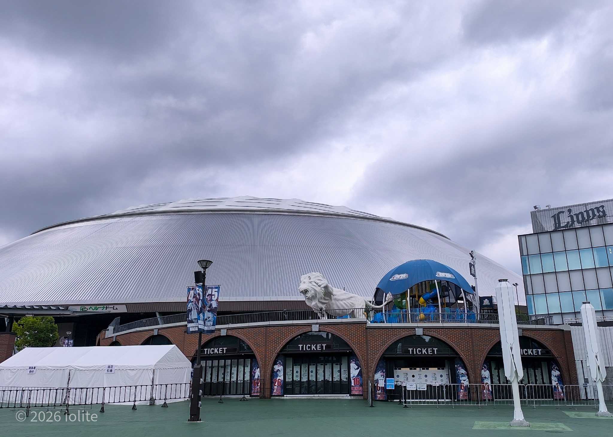
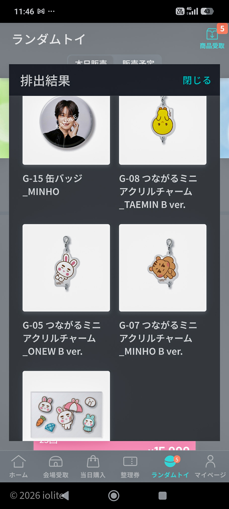
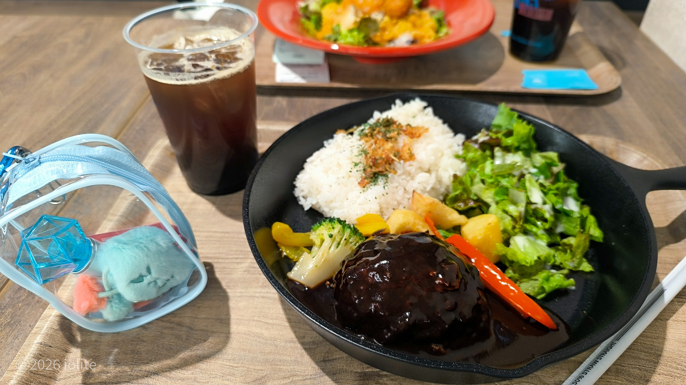
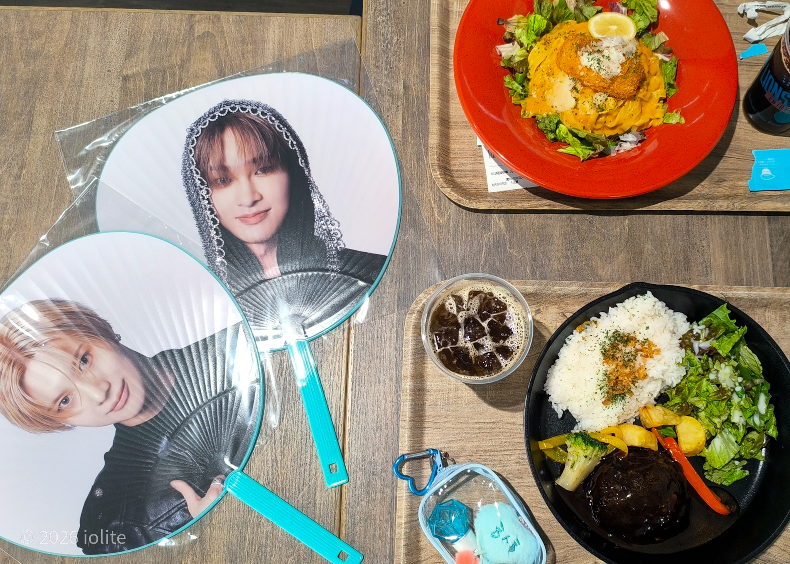
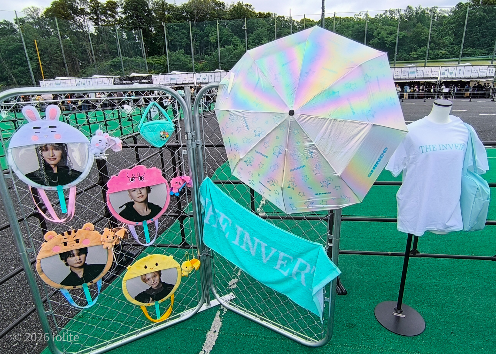
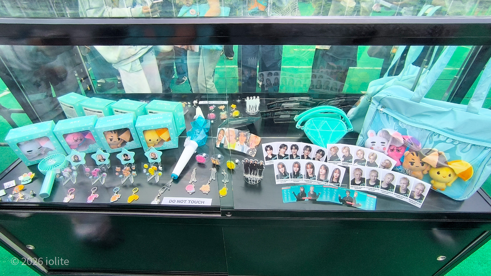
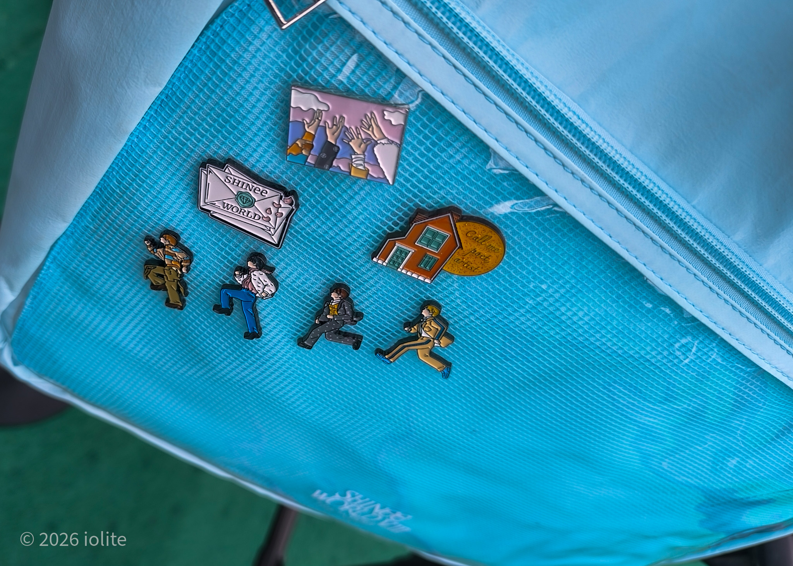

6/5(金)、SHINeeのライブに行ってきた！ 
4人そろっての日本公演はなんと8年ぶり・・・ 
 
初めてのベルーナドーム、めちゃくちゃ心配していったんだけど 
ラッキーなことに、熱くも寒くもなく。トイレにも困らず。 
フツーに快適な１日を過ごした。 
 

 
<h1>交通手段は車で</h1>
帰りの電車を心配して途中で帰るのは嫌だったので、 
普段いかない方面だったので若干不安だったけど車で行くことに。 
 
駐車場調べておくか～と思ったときには 
予約できる駐車場はひとつも開いてなくて 
早く行って確保することにしたけど、なんか普通に空いてた。 
 
ぼったくりプライスの駐車場が多い中、そこは１日千円で停められて 
会場からめちゃ近いのに裏道へ抜けやすくて、帰りもそんな渋滞に巻き込まれなかった！ 
 
確か10時前には駐車場停めて、 
11時過ぎにはグッズ列並んで、12時にはグッズ販売開始して。 
（私は並んでないけど一般販売ブースの流れがすごい遅かった） 


  


会場限定ガチャだけ回したんだけど、なかなかの神引き 
ボンボンシールが想像以上に可愛かった！！ 
（このあとチェミノの缶バッジはボクシリのチャームに交換していただき、無事コンプした） 
 
レストランでご飯食べて 
安くはないけどちゃんと美味しいし、満足できる量だった！ 
しかもずっとSHINeeのMV流れてた！ 


  
  
  
  
  

 

